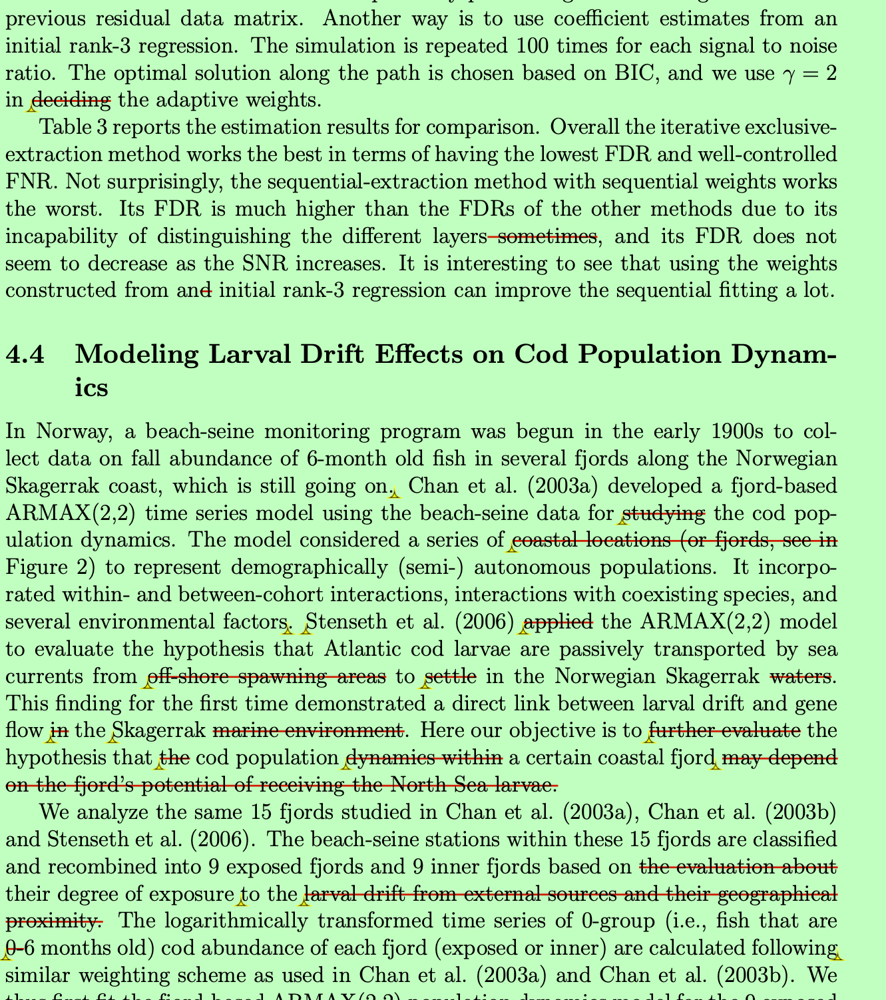

# Introduction {#intro}

What does a statistical or data science paper look like? As with all scientific papers, it should have some commonly expected structures: title, abstract, keywords, introduction, methods, results, discussion, acknowledgements, references, appendix, and supplement. Due to the specificity of the statistical discipline, machine learning practices, and application domains, however, research papers can look very different from one another.  

What does a statistical or data science paper look like, and why should we study it?  
For many graduate students and researchers, writing a paper is one of the most challenging yet most important parts of their training. A paper is more than just record of results; correctness is only the bottom line. A paper is the primary way for researchers to communicate ideas, establish credibility, and contribute to scientific literature. Good writing makes research visible, while poor writing may jeopardize delay the acknowledgement of even the most important discoveries.  

As with all scientific papers, statistical and data science articles generally follow a set of commonly expected structures: title, abstract, keywords, introduction, methods, results, discussion, acknowledgements, references, appendix, and supplement. Yet, due to the specificity of the statistical discipline, the practices of machine learning, and the variety of application domains, research papers can look very different from one another.  

This book (and its companion course) is motivated by the need to make these conventions explicit, to demystify the writing process, and to provide practical guidance through many examples and exercises. It is designed for graduate students and researchers who wish to sharpen their writing, whether they are preparing a dissertation chapter, a methodological paper, or an applied paper. Our goal is to teach students *how* statistical and data science papers are structured, *why* they are written in such ways, and *what* we shall do to adapt writing for different audiences and outlets.

---

## Types of Papers in Statistics and Data Science

### Theory papers

A **theory paper** in statistics and probability is closest in form to a mathematical paper. It typically includes the statement of the problem, formulation of assumptions, and the presentation of theorems, lemmas, and proofs. The purpose is often to establish fundamental properties of certain statistical or probabilistic tools/approaches, including but well beyond consistency, efficiency, optimality, convergence, asymptotic distributions, and non-asymptotic error bounds. 

While theory papers may not always feature data, simulations, or applications, they form the **mathematical and probabilistic foundation** upon which methodology and applied work are built.  

Most of the articles in journals such as *Annals of Statistics*, *Annals of Probability*, *Bernoulli*, *Probability Theory and Related Fields*, among others, are considered as theory papers. In other words, these journals should be the primary outlets for a theory paper. 

Examples include @Foygel2021. 

### Methodological papers
A **methodological paper** focuses on proposing a novel methodological contribution that can be applied to a general class of real-world problems. A commonly seen structure is:  

+ Introduction
+ Literature review
+ Methods (e.g., estimation, hypothesis tests, diagnostic procedures)  
+ Theoretical properties  
+ Simulation studies  
+ Applications/Illustrations  
+ Discussion/Conclusions  

Such papers emphasis on methodological development, with a blend of theory (e.g., asymptotic or non-asymptotic guarantees) and empirical validations.

Such papers emphasize methodological development, often with a blend of theory (e.g., asymptotic or non-asymptotic guarantees) and empirical validations. Astrong methodological paper should not be just a mechanical combination or minor extension of existing methods. Instead, it should be driven by a clear motivation from real-world applications.

In other words, the most impactful methodological contributions are those that connect with practical relevance. They are inspired by genuine applied needs, but provide solutions that are general enough to influence future work in an important domain or even across different domains. 

Example include @li2023regularized and @lau2022bias.  

### Applied papers
An **applied paper** focuses on addressing a concrete scientific question in a particular domain using statistical or data science methods. Its structure often includes:  

+ Introduction  
+ Data description  
+ Methods (applied or adapted)  
+ Results  
+ Discussion  

Sometimes simulation studies are added to assess sensitivity. Applied papers may involve applying existing methods or developing new ones motivated by the application. Examples include @price2022effects; @caplan2019dental; @jiao2022cyberattack.  

It is important to note that what we call "applied papers" here includes a large portion of scientific papers that rely on data analytics, statistics, and machine learning methods. In many scientific domains, these papers may in fact be considered theoretical or methodological contributions within that field. For instance, an applied paper with genomical data analysis could be regarded as a methodological paper in genetics.  

Such works are most often interdisciplinary, typically resulting from close collaborations between statisticians, data scientists, and domain experts. They showcase how quantitative methods advance science in other fields, while also motivating the development of new techniques within statistics and machine learning.

---

### Data Science and Machine Learning Papers

Beyond traditional statistics journals, researchers often publish in data science, machine learning, and data mining journals and conferences, including outlets such as *NeurIPS*, *ICML*, *KDD*, and *AAAI*. These conference papers emphasize:  

- Conciseness (strict page limits)  
- Algorithmic novelty  
- Benchmark comparisons on standard datasets  
- Open-source reproducibility  
- Clarity for an interdisciplinary readership  

<!-- Compared to *JASA* or *Annals of Statistics*, these outlets may prioritize empirical performance and novelty over theoretical justifications or development, though many still include core mathematical analysis. This is in part because of the current  -->

Compared to *JASA* or *Annals of Statistics*, these outlets often prioritize empirical performance and novelty over extensive theoretical justifications or methodological development, though many still include core mathematical or probabilistical analysis. This emphasis partly reflects the nature of the research topics: for many cutting-edge machine learning and AI methods, their theoretical understanding is still evolving and often lags behind practice. As a result, papers are judged primarily on their ability to demonstrate empirical advances on benchmark datasets or practical applications.

---

## Scientific Writing Resources

Many resources on scientific writing are available. For example, @gopen1990science was selected by its publisher, *American Scientist*, as one of its 36 "Classic Articles" from the first 100 years of publishing history. Popular books are @oshima2000writing, @gopen2004expectations, @hairston2003successful, and @lebrun2021scientific.  

---

## About This Book

This book, *Advanced Research Writing in Statistics and Data Science*, extends earlier efforts from [*Statistical Writing*](https://statds.github.io/stat-writing/), by broadening its scope and including hands-on examples and exercises.   

The book emphasizes three guiding principles:  

1. **Clarity**: communicating complex technical ideas to both expert and interdisciplinary audiences.  

2. **Adaptivity**: tailoring style and structure to journals, conferences, and other outlets.  
3. **Learning by Doing**: the book includes examples, annotated excerpts, and practical exercises.  

---

## Outline of the Book

The planned content includes:  

- **Introduction** (this chapter): Types of research papers — theory, methods, and applied — and the conventions of scientific writing across statistics, data science, and machine learning.  
- **Tools and Workflows for Writing**: Version control (Git/GitHub), LaTeX, R Markdown/Bookdown, and reproducibility practices.  
- **Getting Started with Writing**: The research and writing lifecycle, writing proposals, and planning strategies.  
- **Writing Specific Sections**: Titles, abstracts, introductions, methods, results, discussion, figures, tables, captions, and style.  
- **Writing for Different Outlets**: How to adapt writing for different audiences and venues — e.g., writing statistical analysis sections in interdisciplinary papers, preparing concise ML/AI conference papers, and meeting expectations in statistics journals.  
- **Peer Review and Revision**: How to review manuscripts constructively, write referee reports, and respond to reviewers effectively.  
- **Grant Proposals and Research Statements**: Writing for funding agencies, fellowships, and academic job applications.  
- **Ethics and Integrity**: Authorship, plagiarism, collaboration, and responsible use of AI tools.  
- **Exercises and Practice**: Rewriting, reviewing, and polishing tasks, designed to simulate authentic writing and reviewing experiences.  

Each chapter will include **examples drawn from real papers across statistics, biostatistics, and machine learning** and will feature **exercises** that encourage hands-on practice and reflection.

---

## Before We Start

An author should always keep the target audience in mind. Statistical journals span a wide spectrum from applied to theoretical. Machine learning venues differ again in expectations. Even technical reports, white papers, or grant proposals have unique readerships. 

Regardless of outlet, any scientific writing should be convincing and concise. Authors need to show clearly that their work is important, valid, and useful. 

Ultimately, strong writing can never substitute for strong research. In short, keep in mind that **a good paper must rest on good work**. Just as important, a good paper is made through revision. 

Or, as the Chinese phrase puts it: **好文章是改出来的**.

You can view an example of a marked-up draft with comments from my PhD advisor:  
[Download advisor’s comments (PDF)](files/ks-comments.pdf)

{width=70%}

---

